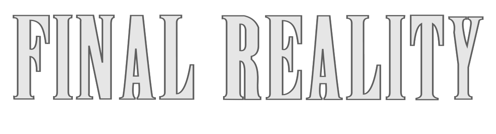

This work is licensed under a 
[Creative Commons Attribution 4.0 International License](http://creativecommons.org/licenses/by/4.0/)

Context
-------

This project's goal is to create a (simplified) clone of _Final Fantasy_'s combat, a game developed
by [_Square Enix_](https://www.square-enix.com)
Broadly speaking for the combat the player has a group of characters to control and a group of 
enemies controlled by the computer.

Game Units
-------

This game consists of the following units:

### Characters

There are 6 types of characters:

| Character  |                                                                                                     Sprite                                                                                                     |
|:----------:|:--------------------------------------------------------------------------------------------------------------------------------------------------------------------------------------------------------------:|
|   Knight   |                                                                                     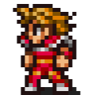                                                                                      |
|  Engineer  |                                                                                    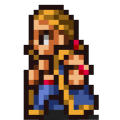                                                                                     |
|   Thief    |                                                                                      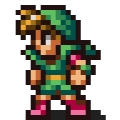                                                                                      |
| Black Mage |                                                                                    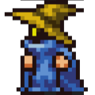                                                                                    |
| White Mage |                                                                                    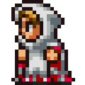                                                                                    |
|   Enemy    | 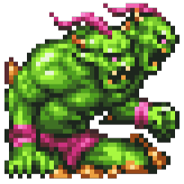 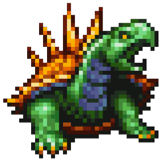 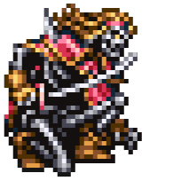 |

The first five characters can be used by the user. Unlike enemies,
this characters can equip weapons. The Black Mage character and White
Mage character correspond to a subtype of playable characters; they
can cast black magic and white magic, respectively.

Each character has a set of weapons they can equip. The constraints for
equipping weapons are listed below:

|                | Sword | Axe  | Knife  | Staff  | Bow  |
|---------------:|:-----:|:----:|:------:|:------:|:----:|
|         Knight |  🟢   |  🟢  |   🟢   |   ❌    |  ❌   |
|       Engineer |   ❌   |  🟢  |   ❌    |   ❌    |  🟢  |
|          Thief |  🟢   |  ❌   |   🟢   |   ❌    |  🟢  |
|     Black Mage |   ❌   |  ❌   |   🟢   |   🟢   |  ❌   |
|     White Mage |   ❌   |  ❌   |   ❌    |   🟢   |  ❌   |

Enemies cannot be played by the user, nor they can equip weapons.
Unlike player's character, enemies have a weight attribute, that will
determine how fast they can attack.

#### Attack mechanics

Each character has a cooldown when they attack. The cooldown's waiting
time is defined by:

- the weapon's weight, if it's a playable character,
- the character's weight, if it's an enemy.

### Weapons

There are five types of weapons:

- Sword
- Bow
- Axe
- Knife
- Staff

Each weapon has their own weight (which is used for the cooldown).
However, the Staff has an extra attribute: magic damage. This is the
only weapon in the game that can be used to cast spells.

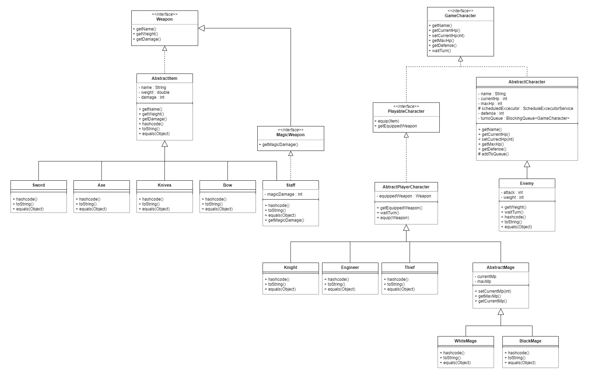

### Spells

There are five different spells:

* **Cure**: Cures an ally 30% of their max HP.
* **Fire**: Reduces the oponent's HP, and there's a 20% chance to set him on fire.
* **Paralysis**: Paralyzes the oponent.
* **Poison**: Poisons the oponent.
* **Thunder**: Reduces the oponent's HP, and there's a 30% chance to leave them paralyzed.

Spells are divided into two categories: white magic and black magic.
White mages can only cast white spells, and black mages can only cast
black spells. Thunder and Fire are black spells, and Cure, Poison and
Paralysis are white spells.

### Effects

There are three different effects:

* **Paralysis**: The affected character can't attack for one turn.
* **Bunrt**: At the beginning of every turn, the affected character's HP will be reduced.
* **Poisoned**: At the beginning of every turn, the affected character's HP will be reduced.

Controller
-------

The controller allows the player to interact with the game. The controller
has a cursor that the player can use to navigate the different options that
they can select. The controller allows the player to attack an enemy, cast
a spell, and equip a weapon.

To handle the states of the game, the controller has a system of states
that knows how to transition, and each of them knows how to behave. Some
states are automatically executed, or played by the CPU, and others wait
for the player to select an options. The states design is shown below.

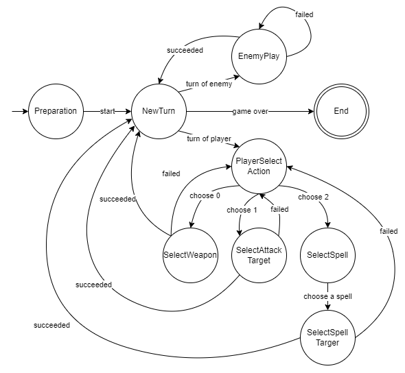

GUI
-------

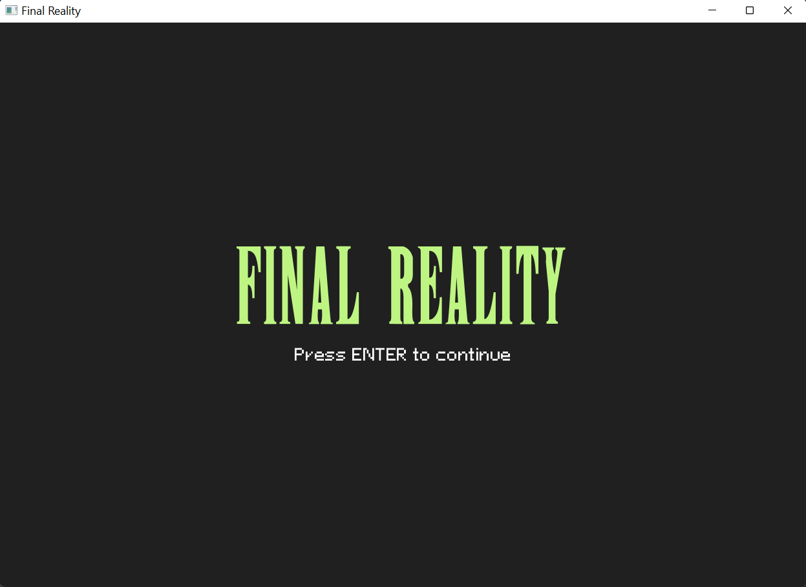

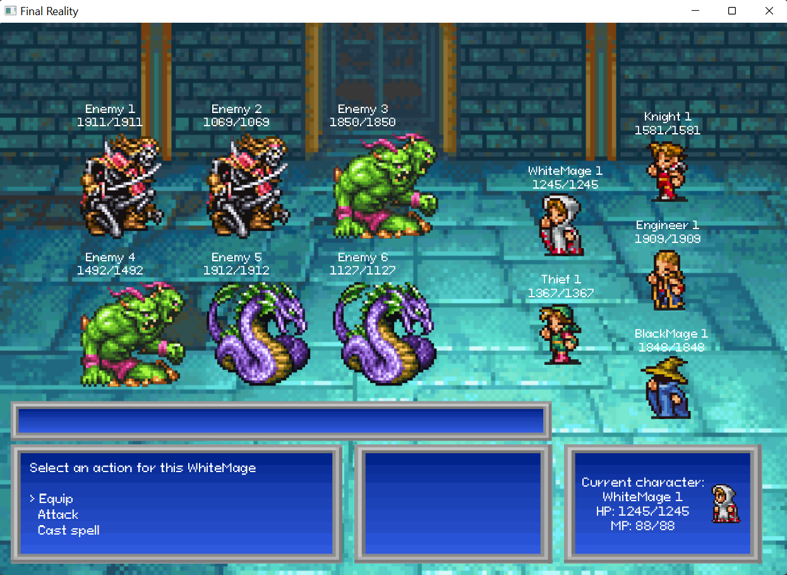

How to play
-------

The goal is to defeat all the enemies before they kill all the player's
characters. At the beginning, none of the characters has a
weapon equipped, so the first step is to equip a weapon to the
current character, and then the player can attack or cast a spell.
After that, the player has to wait for their turn before attacking
again.

### Controls

**Move cursor:** W - UP to move up, S - DOWN to move down.

**Select action:** ENTER - SPACE to select an action.

**Exit:** ESCAPE to close window.

Changes implemented (Firts Assigment)
-------

### Weapons

1. Change type implementation from Enumeration to Classes
and Abstract Classes (polimorphism).
2. Add interface Weapon to be used as a type for all weapons.
3. Add interface MagicWeapon to be implemented by all magic weapons
   (Staff)

### Characters

1. Add abstract class AbstractMage to hold all the common
characteristics between mages. BlackMage and WhiteMage are
extended from this new class.
2. Move waitTurn method from AbstractCharacter to
AbstractPlayerCharacter and Enemy. This allows the code not
to implement instanceof in the waitTurn method. Each class
knows how to behave when the method is called.

Changes implemented (Second Assigment)
-------

### Testing

1. All methods implemented so far have been tested using JUnit5.
All tests are located in the [test folder](src/test/java).

### Weapons restrictions

1. Now, only certain weapons can be equipped by certain characters.
This has been implemented by using double dispatch. The restrictions
for each weapon can be found in the next table:

|                | Sword | Axe  | Knife  | Staff  | Bow  |
|---------------:|:-----:|:----:|:------:|:------:|:----:|
|         Knight |  🟢   |  🟢  |   🟢   |   ❌    |  ❌   |
|       Engineer |   ❌   |  🟢  |   ❌    |   ❌    |  🟢  |
|          Thief |  🟢   |  ❌   |   🟢   |   ❌    |  🟢  |
|     Black Mage |   ❌   |  ❌   |   🟢   |   🟢   |  ❌   |
|     White Mage |   ❌   |  ❌   |   ❌    |   🟢   |  ❌   |

Changes implemented (Third Assigment)
------

### Spells

1. New classes were created to represent spells. Each spell knows what
to do with the targeted character.
2. New classes were created to represent effects. There are three types
of effects:
   - Fire effect
   - Paralysis effect
   - Poison effect
   
   There's also a fourth effect (No effect), which induce no effect on an
enemy. 
3. Player's characters now have a method for spell casting. They can attack
selecting a spell and a target character.
4. New exceptions were created to handle the method for spell casting:
   - InvalidMageException: The spell is not the same type as the mage.
   - InvalidMagicWeaponException: The mage must have a magic weapon equipped.
   - InvalidManaValueException: The mage doesn't have enough mana points.
   - InvalidTargetCharacterException: The targeted character can't receive this spell.
   - NonMagicalCharacterException: The spell can only be cast by mages.

### Controller

1. A class GameDriver was created to handle the interaction between the
player and the game.
2. The controller has methods for equipping weapons, attack characters
and cast spells.
3. The controller has a state that knows how to behave during that turn.
4. A state pattern was created to handle transitions between states.
5. The controller initialize all weapons and characters randomly using
a seed. The initialization of the game's elements is done through
factories.
6. Game driver is a sigleton object.

Changes implemented (Optional assigment)
-------

The GUI was implemented, allowing the player interact with the
game through the controller in a more dynamic way. The GUI contains
sprites for characters and enemies, background music, a background
battle, and two screens (start screen and battle screen), among other
things.